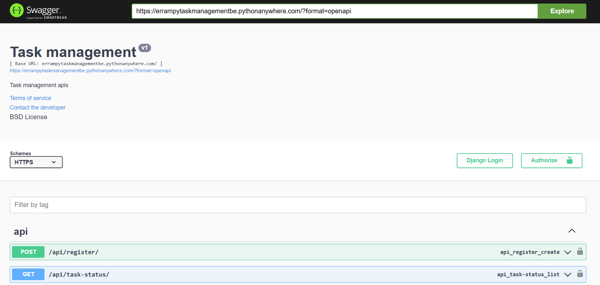
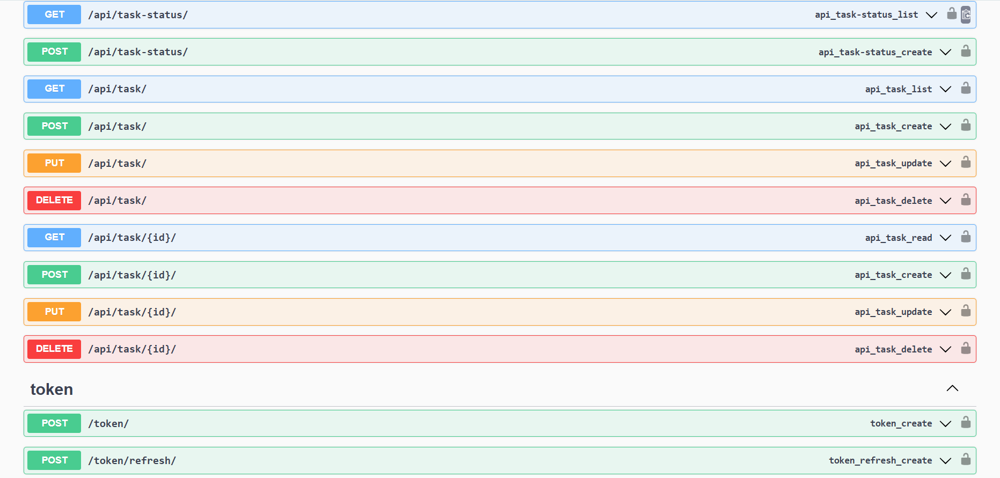

# Task Management System
A task management system backend system built with **Django REST Framework**, **MySQL**, **JWT Authentication** ...

## Features

- User registration & login via JWT authentication
- Task CRUD: Create, view, update, delete tasks
- Filter tasks by status: `Pending` or `Completed`
- Task creation with `title`, `description`, `due_date`, and `status`
- Authenticated user access only — users can see only their own tasks
- .. .. ..

## 🛠️ Tech Stack

- Backend: Django, Django REST Framework
- Database: MySQL
- Authentication: JWT (via djangorestframework-simplejwt)
- Environment: Python 3.8, pip, virtualenv

## Create & Activate Virtual Environment

- python -m venv venv
- source venv/bin/activate

## Install Dependencies

- pip install -r requirements.txt

## Create & Activate Virtual Environment

- python -m venv venv
- source venv/bin/activate

## Configure MySQL in settings.py

DATABASES = {
    'default': {
        'ENGINE': 'django.db.backends.mysql',
        'NAME': 'your_db_name',
        'USER': 'your_mysql_user',
        'PASSWORD': 'your_mysql_password',
        'HOST': 'localhost',
        'PORT': '3306',
    }
}
- Change following details

## Run Migrations

- python manage.py makemigrations
- python manage.py migrate

## Run Development Server

- python manage.py runserver

## Backend Deployed Link

- https://errampytaskmanagementbe.pythonanywhere.com/

## Frontend Deployed Link

- https://feerrampytaskmanagement.pythonanywhere.com/

## API Documentation

- Visit the root URL to access the Swagger-based API documentation automatically generated using drf-yasg.
- This documentation allows you to explore all endpoints, test them interactively, and view request/response formats.

## Task Status Master API

- The /api/task-status/ endpoint provides a list of predefined task statuses such as pending and completed.
- These statuses are stored in a TaskStatus master table and used as a ForeignKey in the main Task table.
- While creating or updating tasks, use the appropriate status ID from this endpoint.

## API Endpoint Summary

| Method      | Endpoint               | Description                                | Authentication |
|-------------|------------------------|--------------------------------------------|----------------|
| POST        | `/token/`              | Generate access and refresh JWT tokens     | No             |
| POST        | `/api/register/`       | Register a new user                        | No             |
| GET/POST    | `/api/task-status/`    | Get or create task status (e.g., pending)  | No             |
| GET/POST    | `/api/task/`           | List or create tasks for logged-in user    | Yes            |
| PUT/DELETE  | `/api/task/{id}/`      | Retrieve, update or delete a specific task | Yes            |
| GET         | `/api/task/?status=id` | Filter tasks by status ID (pending, etc.)  | Yes            |
| GET         | `/api/task/?task_id=id`| Get tasks details by task ID               | Yes            |

## Screenshot of apis documentation

## [My Linkedin](https://www.linkedin.com/in/errampy/)

## Thank you...!!!